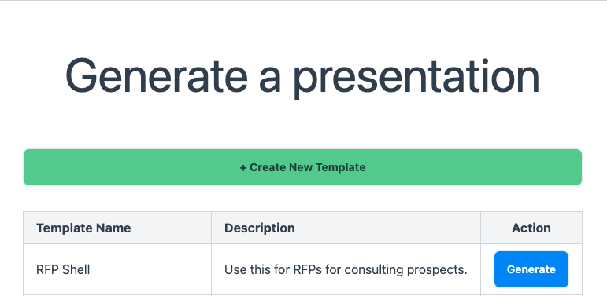
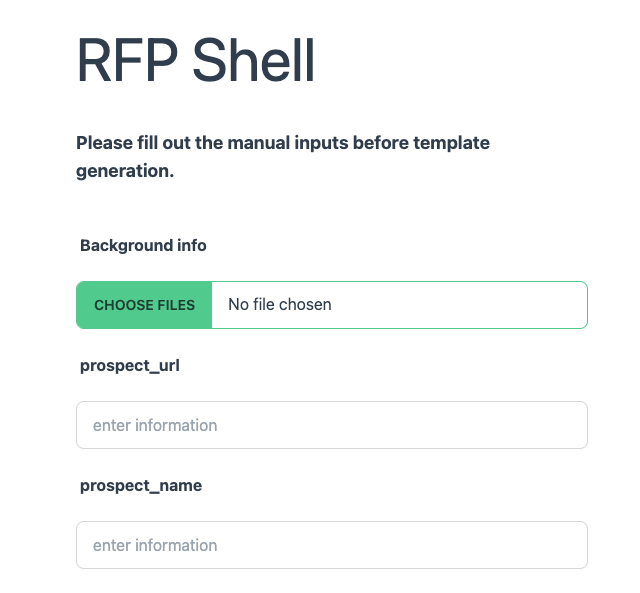

After creating your templates, you can use them to generate dynamic content. All you need to do is pick the template that you want to use and click the "Generate" button:

After this, you'll be brought to a screen where you can upload files and generate your presentation. Currently, we support **PDF and .DOCX files.**, with additional file formats to come soon.

