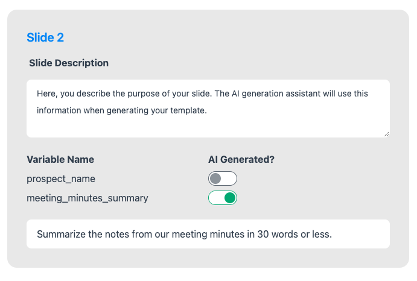

!!! warning "This is a key step!"

    Make sure to take your time when configuring templates. Any time spent here will save you time down the line, becuase you'll get better outputs from AI.

After uploading a template, PropPilot scans it for all of the variables that you created and then brings you to the template settings page.

You'll see a set of slides, each with their own configuration options. Make sure to give a descriptive purpose of the slide and to toggle on all of the variables that you want AI to generate.

!!! info "Why variable toggles?"
    Sometimes, you might want to manually input variables. Things like names, URLs, etc., might be easier to add yourself at template generation time than to have AI generate. This is why we don't set everything as AI generated by default. 

Here's a sample of a configured slide:
